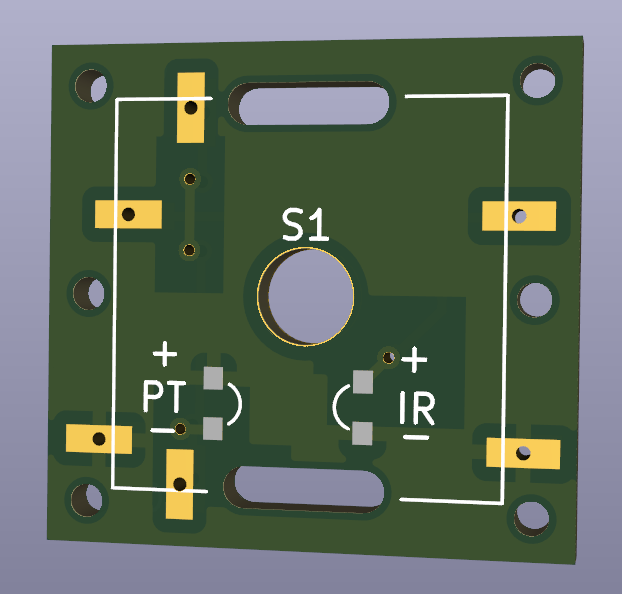
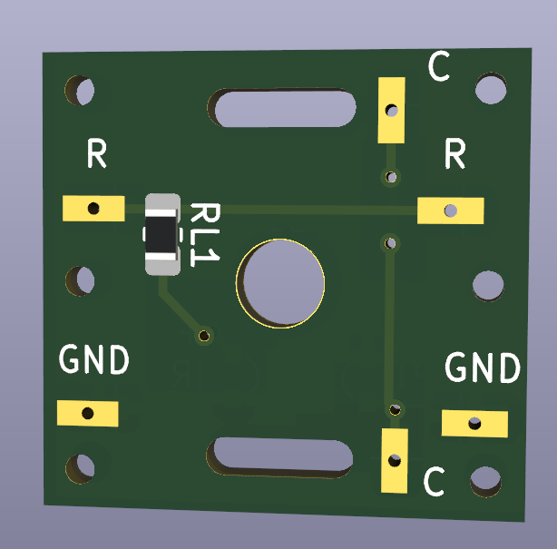

These single key pcbs can be used to make a dactyl based on keychron switches.

The footprints of the pcb come from the [keyboard design](https://github.com/girishji/keychron-optical-keyboard) by girish.
See his [blog post](https://girishji.github.io/2022/08/17/optical-keyboard-design.html) for more details on how to design your keyboard.

I did some tests with these pcbs, but I didn't
end up building the whole keyboard. If you want to experiment with these pcbs make sure to
have a hot air gun to do the SMD soldering of the IR and PT.

